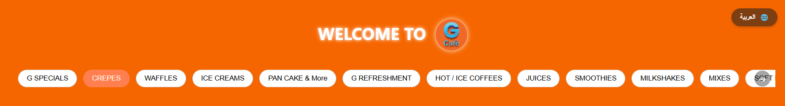
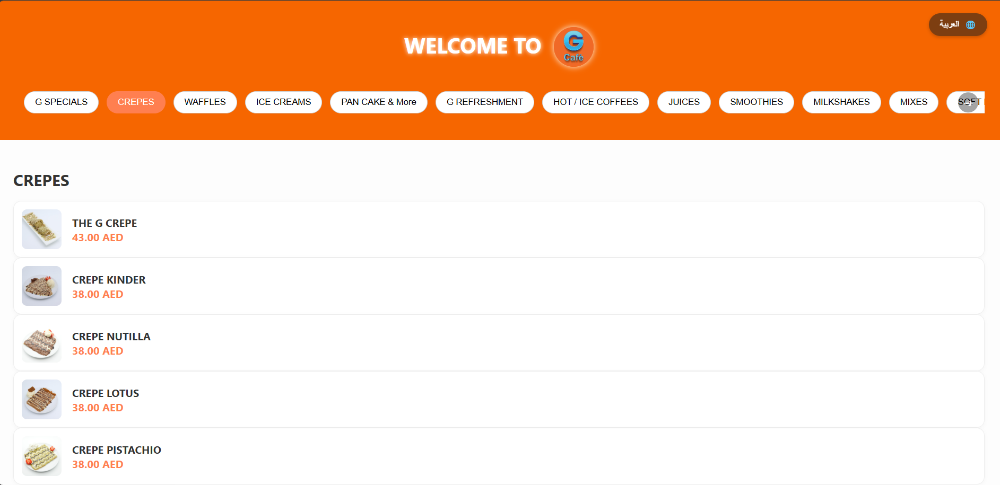
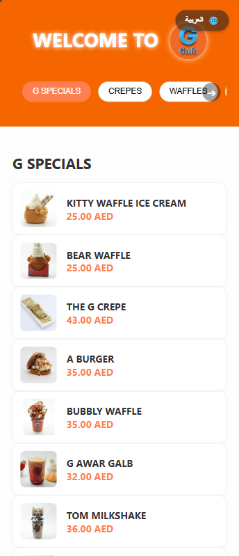
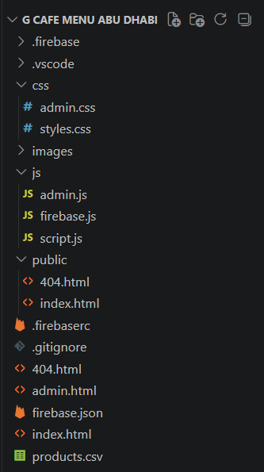

# ☕ G Cafe Digital Menu

> A responsive digital menu developed for **G Cafe Abu Dhabi**, allowing customers to browse menu items while enabling administrators to manage products through Firebase.

> **Note:** The source code is proprietary and owned by the client. This repository is a showcase containing screenshots only.

---

## Features

- Responsive design
- Category-based menu
- Product images and pricing
- Arabic & English support
- Firebase-powered data management
- Admin dashboard
- Mobile-friendly interface

---

## Technologies

- HTML5
- CSS3
- JavaScript
- Firebase
- Firebase Hosting

---

## Screenshots

### Menu

### Mobile

### architecture

---

## My Contributions

- Designed the user interface
- Developed the customer menu
- Built the admin dashboard
- Integrated Firebase
- Implemented responsive layouts
- Deployed the application

---

## Repository Notice

The original source code is proprietary and belongs to the client.

This repository is intended for portfolio purposes only and contains screenshots of the project.
